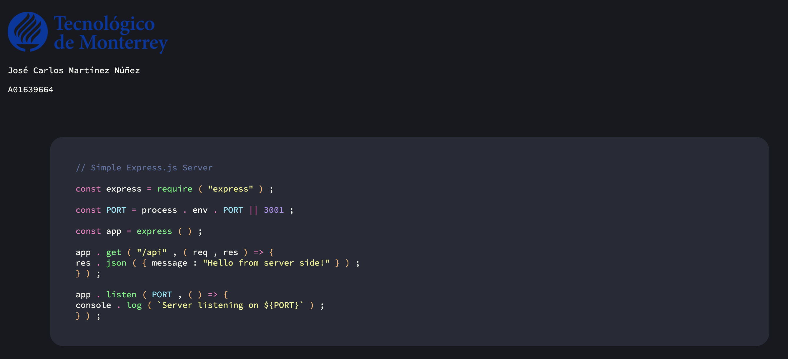
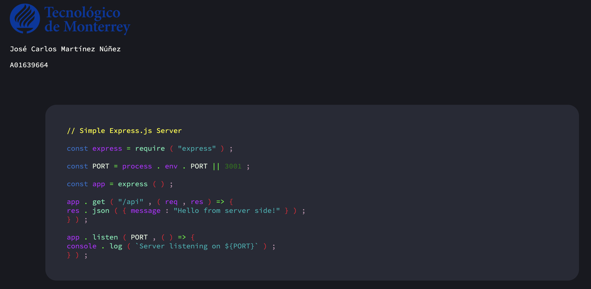
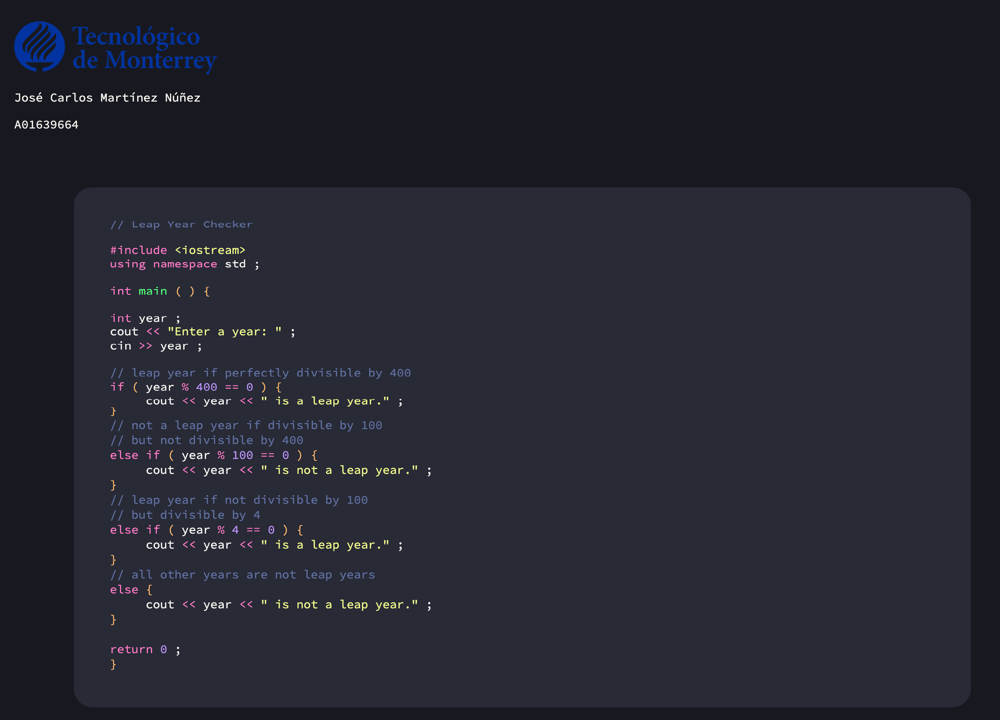
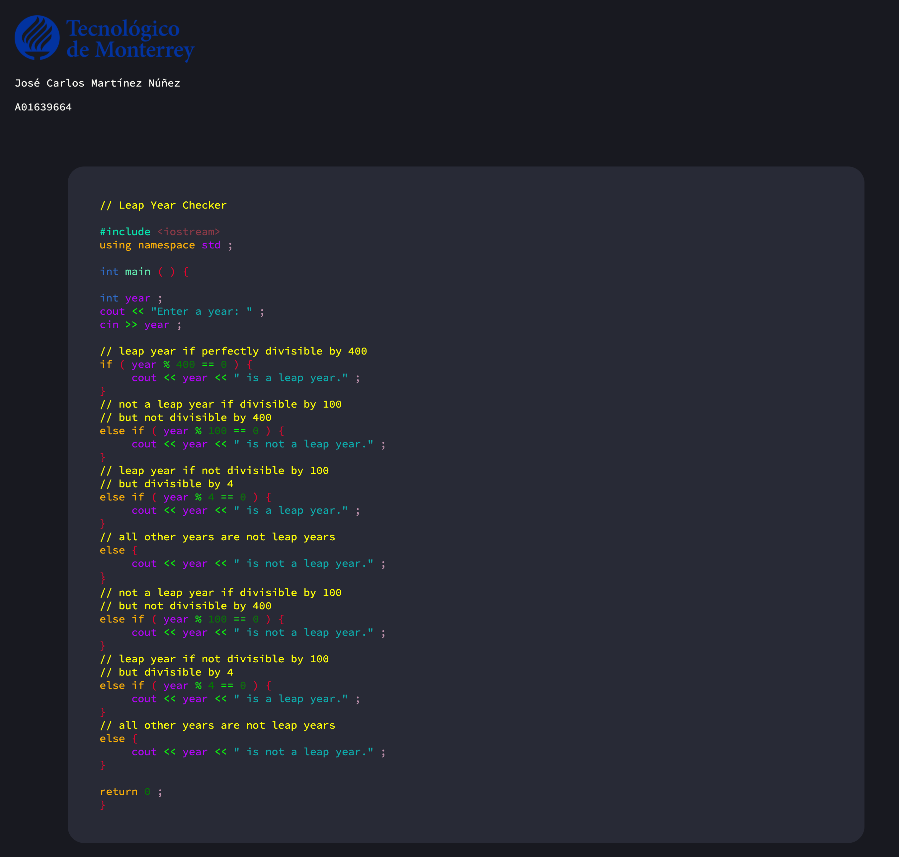
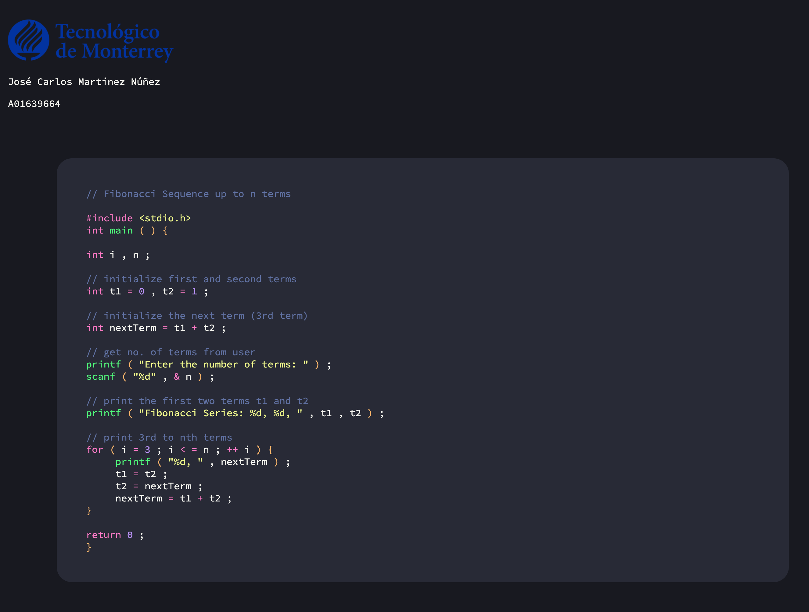
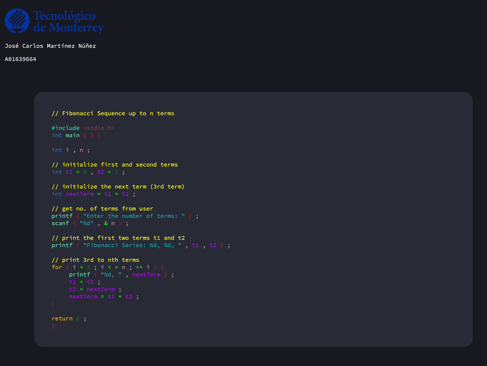

<div id="top"></div>

[![Contributors][contributors-shield]][contributors-url]
[![Forks][forks-shield]][forks-url]
[![Stargazers][stars-shield]][stars-url]
[![Issues][issues-shield]][issues-url]
![Languages][languages-shield]

<br />
<div align="center">
  <a href="https://github.com/josecarlosmemo/syntax-highlighter">
    
  </a>
<h3 align="center">Syntax Highlighter (C++, C, JS)</h3>
This is a syntax-highlighter was made for the class Implementation of
Computational Methods, using FLEX (fast lexical analyzer generator) and
C++.
  <p align="center">
    <br />
            <a href="https://github.com/josecarlosmemo/syntax-highlighter"><strong>Explore the docs »</strong></a>
            <br />
    <br />
    <a href="https://github.com/josecarlosmemo/syntax-highlighter/issues">Report Bug</a>
    ·
    <a href="https://github.com/josecarlosmemo/syntax-highlighter/issues">Request Feature</a>
          </p>
</div>

### Built With

<div>

</div>

<p align="right">(<a href="#top">back to top</a>)</p>

**Author:** [José Carlos Martínez Núñez \|
A01639664](https://github.com/josecarlosmemo)

## Table of Contents

- [Table of Contents](#table-of-contents)
- [Lexical Categories](#lexical-categories)
- [Color Schemes](#color-schemes)
  - [Dracula](#dracula)
  - [Rainbow](#rainbow)
- [Installation](#installation)
- [Usage/Examples](#usageexamples)
- [The implemented algorithms and their execution time](#the-implemented-algorithms-and-their-execution-time)
- [Screenshots](#screenshots)
- [Time Complexity](#time-complexity)
  - [How does FLEX work?](#how-does-flex-work)
  - [Other Algorithms](#other-algorithms)
- [The SpeedUp by using multiple threads](#the-speedup-by-using-multiple-threads)
  - [Using One Thread](#using-one-thread)
  - [Using 8 Threads](#using-8-threads)
  - [Calculating the SpeedUp](#calculating-the-speedup)
- [Ethical Implications that this type of technology could have on society](#ethical-implications-that-this-type-of-technology-could-have-on-society)
  - [Lexical Analysis](#lexical-analysis)
  - [Multiproccessing / Parallel Programming](#multiproccessing--parallel-programming)
- [Acknowledgments](#acknowledgments)
- [References](#references)
- [Contributing](#contributing)

## Lexical Categories

The Lexical Categories supported by this program are:

- Preprocessor Keywords
- Reserved Words
- Types
- Operators
- Booleans
- Grouping Characters
- Multi Line Comments
- Single Line Comments
- Strings
- Function Names
- Class Identifiers
- Identifiers
- Package Names

These are all matched with their respective regular expressions in the
**Lexer.l** file.

## Color Schemes

The syntax-highlighter supports two color schemes for each lexical
category:

### Dracula

| Token                 | Color                                                                                         |
|-----------------------|-----------------------------------------------------------------------------------------------|
| Preprocessor Keywords |  \#ff79c6 |
| Reserved Words        |  \#ff79c6 |
| Types                 |  \#ff79c6 |
| Operators             |  \#ff79c6 |
| Booleans              |  \#bd93f9 |
| Grouping Characters   |  \#ffb86c |
| Multi Line Comments   |  \#6272a4 |
| Single Line Comments  |  \#6272a4 |
| Strings               |  \#f1fa8c |
| Function Names        |  \#50fa7b |
| Class Identifiers     |  \#8be9fd |
| Identifiers           |  \#f8f8f2 |
| Package Names         |  \#f1fa8c |

### Rainbow

| Token                 | Color                                                                                         |
|-----------------------|:----------------------------------------------------------------------------------------------|
| Preprocessor Keywords |  \#00e9b0 |
| Reserved Words        |  \#feb300 |
| Types                 |  \#306cc9 |
| Operators             |  \#00ff00 |
| Booleans              |  \#18b646 |
| Grouping Characters   |  \#e8002e |
| Multi Line Comments   |  \#81800c |
| Single Line Comments  |  \#ffff00 |
| Strings               |  \#00aeae |
| Function Names        |  \#65ecb1 |
| Class Identifiers     |  \#e4f4df |
| Identifiers           |  \#ba00ff |
| Package Names         |  \#903a47 |

## Installation

``` sh
  # Generate Lexical Analyzer
  flex Lexer.l
  # Compile Generated Analyzer with the main.cpp
  g++ -pthread -std=c++17 Lexer.cpp main.cpp -o "syntax-highlighter"
```

## Usage/Examples

``` sh
./syntax-highlighter [FILE | DIRECTORY]
```

**The output file will be saved in output/\[FILE \| DIRECTORY\].html.**

## The implemented algorithms and their execution time

Once the program opens a file, the lexical analyzer will loop through
each character, once a match is found the resulting string will be HTML
encoded, once again looping through each matched character and replacing
every HTML specific symbol (\<, \>, etc.) with their respective
alternatives. Then depending on the selected color scheme it’ll assign a
color to the specific matched string and write it to the output file.

The output of the program is an html document with the lexical
categories in their respective colors. The console output will be the
execution time of the program measured in milliseconds.

**Note:** The execution time of the program will vary depending on your
computer specs.

## Screenshots

The following example files are located in the **examples** folder.

|  |  |
|------------------------------------|------------------------------------|

<p align="center">
**“example.js” Execution Time 2 milliseconds**
</p>

|  |  |
|-------------------------------------|-------------------------------------|

<p align="center">
**“example.cpp” Execution Time 1 milliseconds**
</p>

|  |  |
|-----------------------------------|-----------------------------------|

<p align="center">
**“example.c” Execution Time 1 milliseconds**
</p>

## Time Complexity

### How does FLEX work?

Flex (fast lexical analyzer generator) is a free and open-source
software alternative to lex. It is a computer program that generates
lexical analyzers (also known as “scanners” or “lexers”).

A Flex lexical analyzer usually has time complexity *O*(*n*) in the
length of the input. That is, it performs a constant number of
operations for each input symbol.

### Other Algorithms

Apart from the code generated by the lexical analyzer once a token is
matched we run another *O*(*n*) algorithm to remove any HTML special
characters.

**This means that the total time complexity of the whole program is
*O*(*n*<sup>2</sup>).**

Nevertheless, as seen in the last section the program runs fairly fast.

## The SpeedUp by using multiple threads

For these tests a total of **898 files** were used (located at
`/examples` folder) with a total of **320 different subfolders** divided
among the three languages JavaScript, C and C++.

### Using One Thread


As seen in the image the total time taken to convert all files was
**9313 milliseconds.**

### Using 8 Threads


As seen in the image the total time taken to convert all files was
**4634 milliseconds.**

### Calculating the SpeedUp

The SpeedUp of a program is calculated by the following formula:


Where:

- 
    is the number of processors (or cores)
- 
    is the time taken to execute the single processor version of the
    program
- 
    is the time taken to execute the multi-processor version of the
    program using
    
    processors
- Lastly,
    
    is the SpeedUp obtained by using
    
    processors.

Using the above formula we can calculate the **SpeedUp** using a total
of *8 threads*.


We can conclude that by using *8 threads* we practically **doubled** the
speed of our program.

## Ethical Implications that this type of technology could have on society

### Lexical Analysis

This type of technology has many uses apart from creating syntax
highlighters, technologies like Flex allow us to create lexical
analyzers that can be used for all types of purposes from creating our
own interpreters for other programming languages to automating lots of
processes that require identification of tokens. One example of how
these technologies can help society is analyzing laws to fix ambiguous
wording or in the research field to analyze dead languages from our past
so that understand more about other civilizations. Performing all these
tasks with the help of computers will greatly improve the amount of time
it’ll take to do this manually. It is incredibly important that
technologies like these are used for good and not personal gain.

### Multiproccessing / Parallel Programming

This technology has incredible implications on society as it can
basically speed up most actions that take a long time in all programming
aplications. Using the example stated above this type of technology can
seriously speed up the process of analyzing languages, making it so that
we can perform the advances stated above orders of magnitude faster,
taking advantage of all the computer power at our disposal.

## Acknowledgments

The following GitHub repos were used as example code for this program:

- [@mandliya/algorithms_and_data_structures](https://github.com/mandliya/algorithms_and_data_structures)
- [@TheAlgorithms/C](https://github.com/TheAlgorithms/C)
- [@trekhleb/javascript-algorithms](https://github.com/trekhleb/javascript-algorithms)

## References

- Funchal, G. (2011, April 14). Most efficient way to escape XML/HTML
    in C++ string?. Stack Overflow.
    <a href="https://stackoverflow.com/a/5665377" class="uri">https://stackoverflow.com/a/5665377</a>

- Levine, John R.; Mason, Tony; Brown, Doug (1992). lex & yacc (2nd
    ed.). O’Reilly. p. 279. ISBN 1-56592-000-7. A freely available
    version of lex is flex.

## Contributing

Contributions are what make the open source community such an amazing place to learn, inspire, and create. Any contributions you make are **greatly appreciated**.

If you have a suggestion that would make this better, please fork the repo and create a pull request. You can also simply open an issue with the tag "enhancement".
Don't forget to give the project a star! Thanks again!

1. Fork the Project
2. Create your Feature Branch (`git checkout -b feature/AmazingFeature`)
3. Commit your Changes (`git commit -m 'Add some AmazingFeature'`)
4. Push to the Branch (`git push origin feature/AmazingFeature`)
5. Open a Pull Request

<p align="right">(<a href="#top">back to top</a>)</p>

[contributors-shield]: https://img.shields.io/github/contributors/josecarlosmemo/syntax-highlighter.svg?style=for-the-badge
[contributors-url]: https://github.com/josecarlosmemo/syntax-highlighter/graphs/contributors
[forks-shield]: https://img.shields.io/github/forks/josecarlosmemo/syntax-highlighter.svg?style=for-the-badge
[forks-url]: https://github.com/josecarlosmemo/syntax-highlighter/network/members
[stars-shield]: https://img.shields.io/github/stars/josecarlosmemo/syntax-highlighter.svg?style=for-the-badge
[stars-url]: https://github.com/josecarlosmemo/syntax-highlighter/stargazers
[issues-shield]: https://img.shields.io/github/issues/josecarlosmemo/syntax-highlighter.svg?style=for-the-badge
[issues-url]: https://github.com/josecarlosmemo/syntax-highlighter/issues
[languages-shield]: https://img.shields.io/github/languages/count/josecarlosmemo/syntax-highlighter.svg?style=for-the-badge
